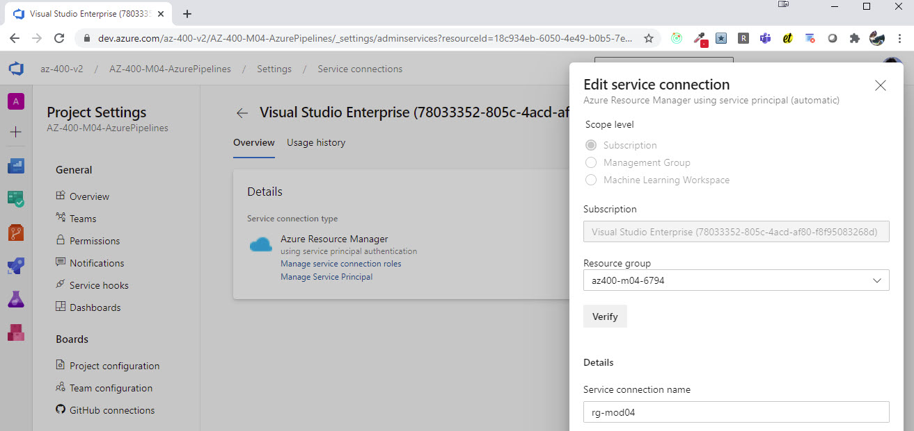
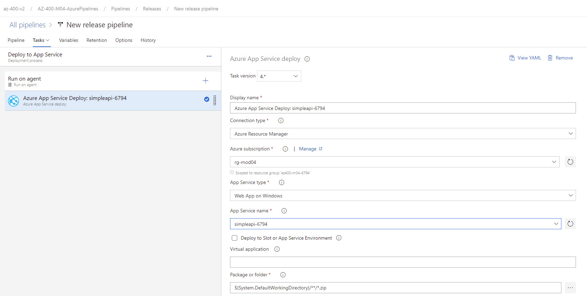

# Deploy Simple Api

- Create hosting AppService by executing `create-app-service.azcli`
- Create a `rg-mod04` Service Connection
- Import a pipeline from json
- Check using the following URL: `https://simpleapi-$RND.azurewebsites.net/api/simple`

