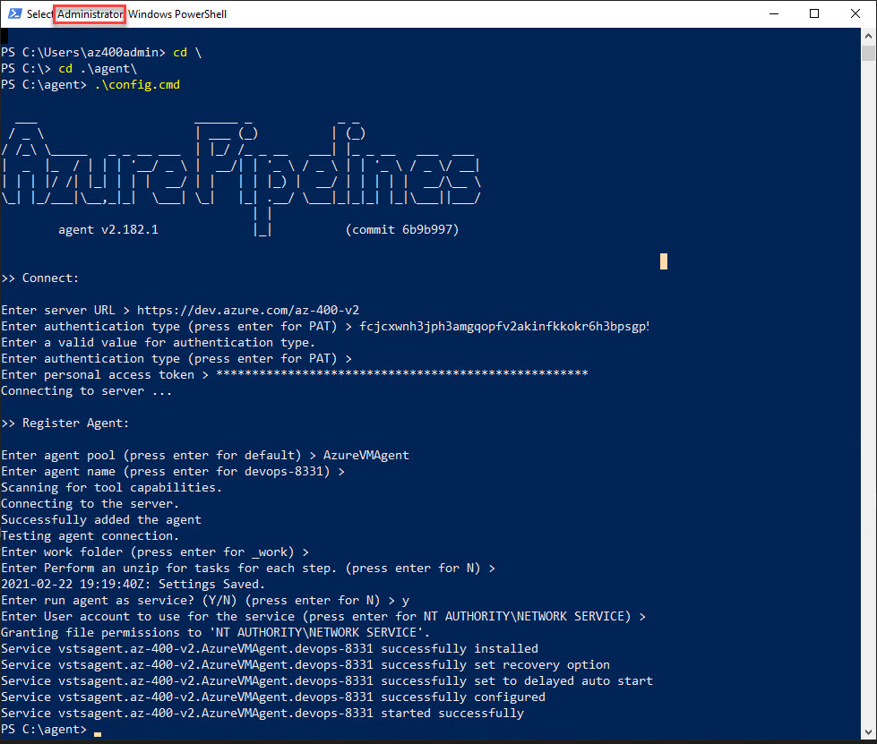

# Custom Build Agent

- Execute `create-build-vm.azcli` to install the vm
- Execute `setup-devops-agent-vm.ps1` to install Build Agent on VM
- Execute `configure-devops-agent.ps1`
- Complete config:

## Readings

[Self-hosted Windows agents](https://docs.microsoft.com/en-us/azure/devops/pipelines/agents/v2-windows?view=azure-devops)
