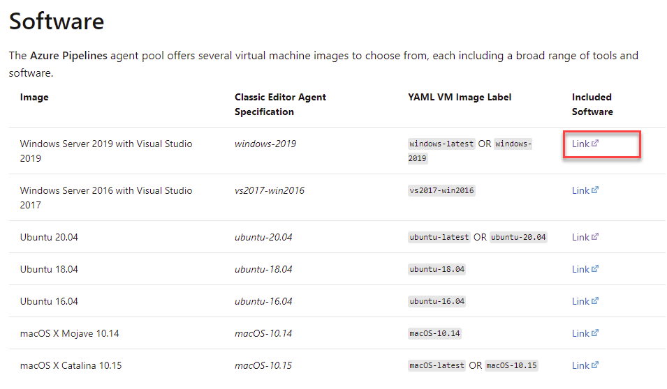

# Implement & Use a Self-hosted Docker Agent

Implement & Use a Self-hosted Docker Agent hosted on Azure Container Instances

- Self hosted Docker Linux Agent
- Self hosted Docker Windows Agent

[Microsoft Hosted Agents Software Inventory](https://docs.microsoft.com/en-us/azure/devops/pipelines/agents/hosted?view=azure-devops&tabs=yaml) gives you a starting point for software installed on Azure-hosted-agents

## Readings

[Run a self-hosted agent in Docker](https://docs.microsoft.com/en-us/azure/devops/pipelines/agents/docker?view=azure-devops)

[Authenticate with Azure Container Registry from Azure Container Instances](https://docs.microsoft.com/en-us/azure/container-registry/container-registry-auth-aci)
